Internet shopping site

Technologies 

Java

Spring MVC, Spring security

Hibernate 4

PostgreSQL 

Maven

Thymeleaf 3

JS (native), JQuery

Bootstrap 4.0.0

Description of the application
-	User can do the following

    -   register account
    -   login into his/her account.   
    -   browse through the catalog of products. 
    -   filter catalog according to the category of the product.
    -   view detail page of the product
    -   add product to the cart
    -   update cart
            delete product
            change quantity of items
        	buy items in the cart
        	
    -   browse history of orders
    -   browse news
            view catalog of news
            view news detail page

-	Administrator can do the following

    -   User
           	read user information
            add user
            update user information
            delete user
    -   Product
        	read product information
        	add product
        	update product information
        	delete product
    -   News
            read catalog of news
        	add news
            update news
            delete news
    -	Orders
        	read all orders

Screenshots

Main page

 

LOGIN PAGE
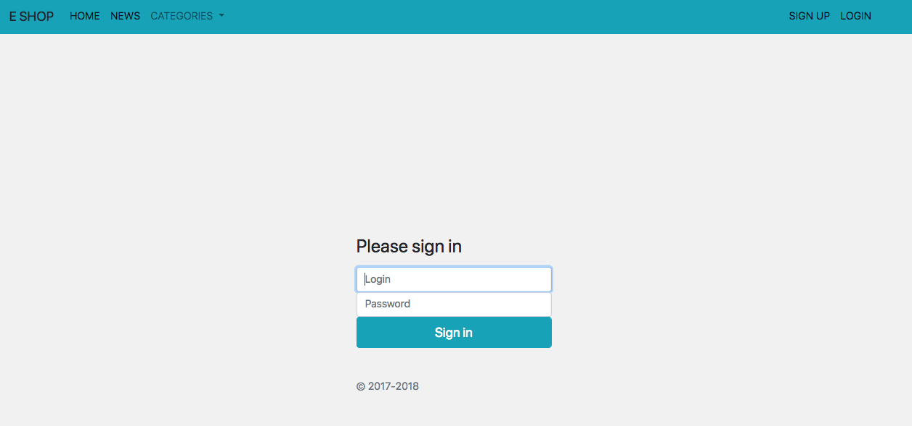

REGISTRATION PAGE
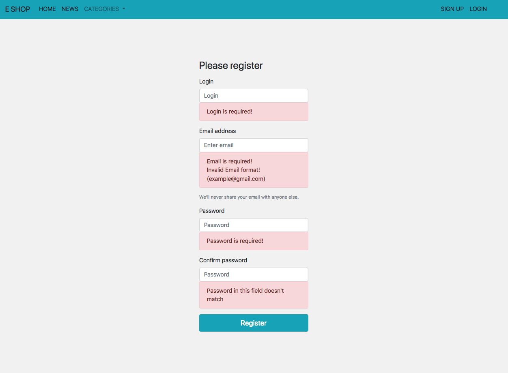

USER MENU

MENU ADMIN
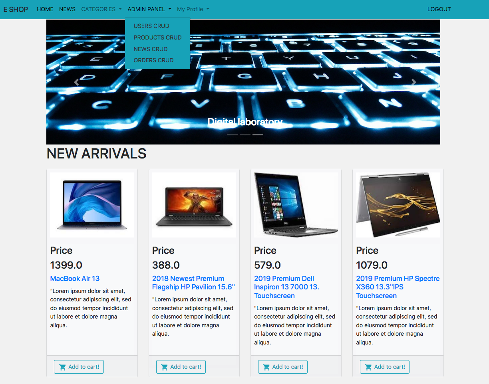

ADD PRODUCT
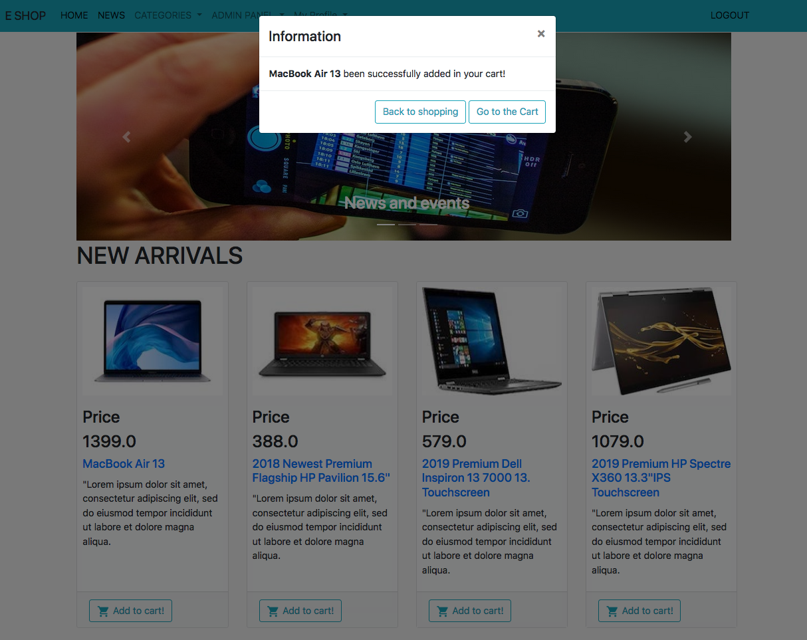

USER CART
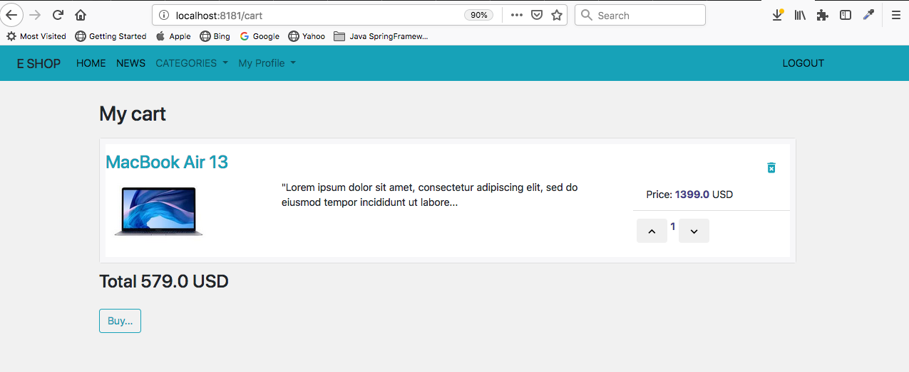

USER ORDERS HISTORY
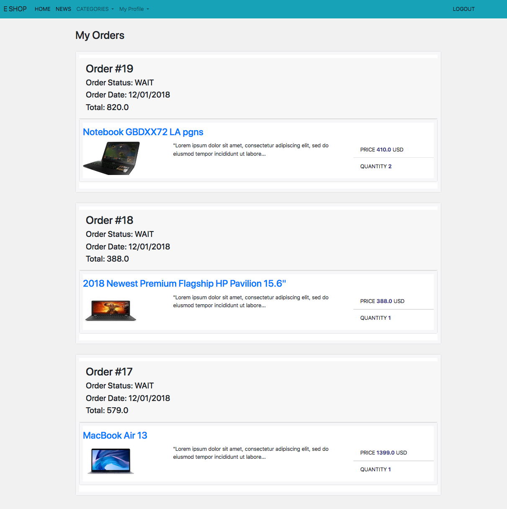

ADMIN PANEL/USERS LIST
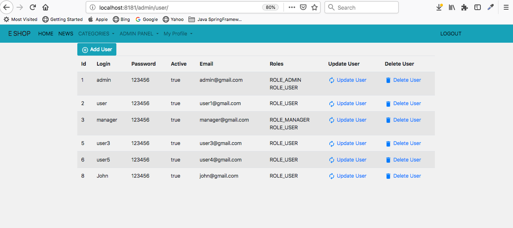

UPDATE USER INFO
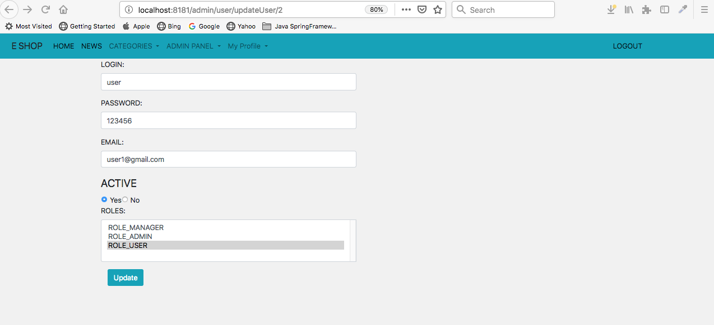

ADD USER 
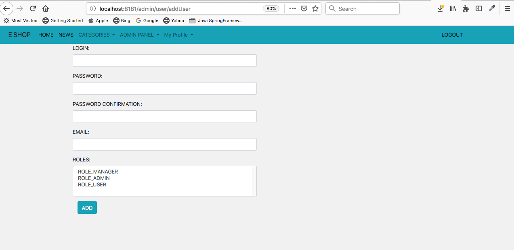

DELETE USER
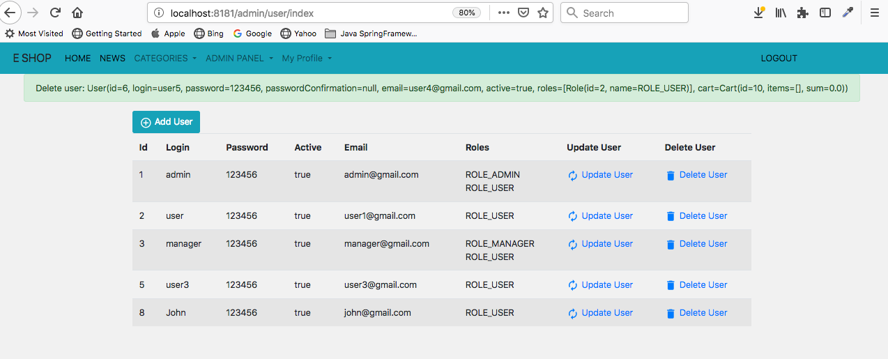

ERROR PAGE
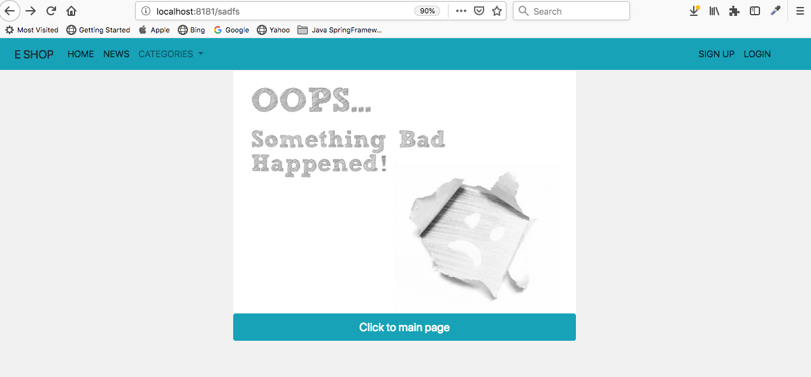

